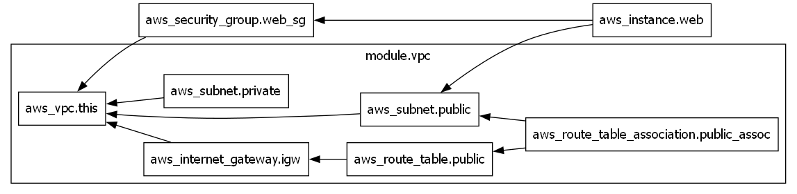

# Production-Grade Terraform AWS VPC & EC2 Deployment

## Overview
This project demonstrates how to deploy a secure, scalable AWS network and compute infrastructure using Terraform and reusable modules for real-world environments.

It is designed as a production-ready starting point for startups, SaaS applications, and DevOps teams who want repeatable cloud infrastructure using Infrastructure as Code (IaC).

## Architecture
## Architecture Diagram



- Custom VPC
- Public and private subnets
- Internet gateway
- Public route table and associations
- Security group for HTTP and SSH
- EC2 instance in a public subnet

## Tech Stack
- Terraform
- AWS (VPC, Subnets, IGW, EC2, Security Groups)
- AWS CLI (for authentication via profiles)

## Authentication
No AWS credentials are stored in this repository.

Terraform uses your local AWS CLI configuration:

```bash
aws configure      # done once on your machine


The aws_profile variable (default: default) tells Terraform which profile to use.

How to Deploy
git clone https://github.com/esthy2/terraform-ec2-vpc-module.git
cd terraform-ec2-vpc-module

# Copy example variables and update real values
cp terraform.tfvars.example terraform.tfvars
```
---

```
terraform init
```
```
terraform fmt
```
```
terraform validate
```
```
terraform plan
```
```
terraform apply
```

To destroy the resources:
```
terraform destroy
```

---

Outputs

vpc_id – ID of the created VPC

public_subnet_ids – IDs of public subnets

private_subnet_ids – IDs of private subnets

ec2_public_ip – Public IP of the EC2 instance
---
Author

Esther Egbe
Cloud & DevOps Engineer
AWS • Terraform • Kubernetes • CI/CD
